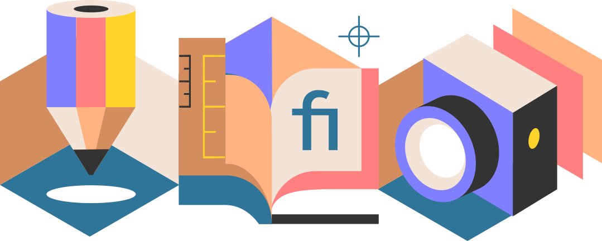

# Studijní materiály pro kurzy Digitální Akademie

## V tomto repozitáři se nacházejí dokumenty doplňující sérii kurzů Digitální Akademie na YouTube a na stránkách https://akademie.netlify.app/.

# Digitální malba, modelování a animace
Výukový program je zaměřený na kreativní oblasti, využívající digitální technologie. Struktura kurzů se soustřeďuje na základy, univerzální pro všechny platformy s cílem poskytnout informace, které nejsou omezené jen na konkrétní software. Hlavní témata jsou digitální kresba a malba, grafika a typografie, 3D modelování a rendering, filmový střih a vizuální efekty.

# Software je volně dostupný a open-source
Kurzy jsou navrženy tak, aby se jich mohl účastnit každý. Cvičení probíhají v profesionálních programech s open-source licencí, které jsou volně dostupné ke stažení a užívání bez omezení. 

# Objevuj nové světy a nauč se další vytvářet!
Trénuj svoje pozorovací schopnosti a koordinaci při kresbě a malbě, kreativní myšlení při 3D modelování, soustředění při střihu filmu nebo pevnou vůli při experimentování s novou technikou. 
